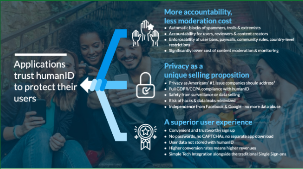
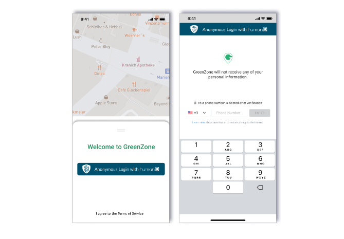
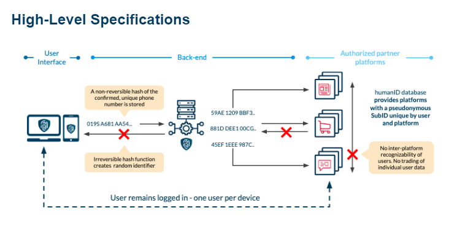
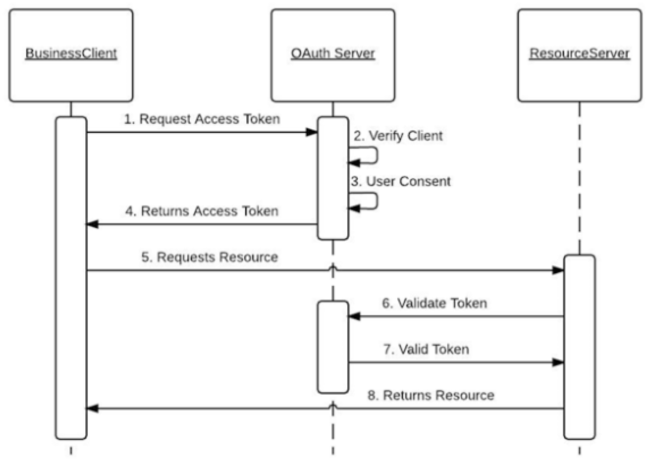
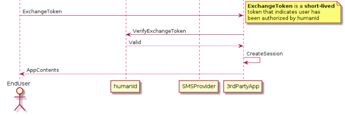

## Summary

### humanID
* Creates a **fully anonymous, privacy-first identity** that enables communities to block bots and abusive users. 
* Protects the identity of its users through an **irreversible hash**, generating an ID that is unique to each user and platform the user is logging into.
* Enables platforms to decrease the cost of monitoring and moderating content, eliminates the significant business risk of data leaks, and appeals to a growing audience of privacy-focused consumers. 

  

 

### Overview

humanID is a nonprofit, open-source initiative building a replacement to social media logins such as “Login with Facebook” and other invasive tools such as Google’s reCAPTCHA. Unlike existing logins, humanID has developed technologies that massively increase the cost for automated accounts, bots, and previously banned users to return to a website. humanID also allows users to sign onto third-party websites or apps with total anonymity, creating higher levels of trust and protection from data breaches. Our model is fully GDPR/CCPA-compliant.

The team is proud of our robust and diverse leadership on both technical and business aspects. Together, we are building world-class technology as public 
infrastructure for the web of tomorrow.

humanID's leadership team includes experienced cybersecurity experts, seasoned entrepreneurs, and graduates from some of the highest-ranked colleges and universities  in the United States. Our early development was supported and funded by Harvard Business School. 

 

### Why humanID

* [40 billion data records](https://www.securitymagazine.com/articles/96946-over-40-billion-records-were-exposed-in-2021) were breached in 2021, costing U.S. companies an average of $4.24M in damages. Data breaches not only damage the trust that users place in information technologies; financial and reputational costs also represent an existential threat to businesses. 
*  Stronger privacy leads to better conversion and engagement rates —  [research conducted by the Symposium on Usable Privacy and Security](https://static.googleusercontent.com/media/research.google.com/en//pubs/archive/38142.pdf) has shown that users who feel that their privacy is protected are more likely to engage with an online service.
* Without an accountable and persistent online ID, threatening actors can exploit online platforms by registering malicious accounts and creating networks of bots. These networks can manipulate everything from reviews and ranking algorithms to public opinions and elections.
* Online communities are polluted by bots, spam, and bullies, which makes online trust and safety rules difficult to enforce. 
* Distrust of Big Tech is [rising](https://www.axios.com/2020/02/25/big-tech-industry-global-trust), leading users to reject current authentication methods such as “Login with Facebook”. 

**By bringing back security, privacy and accountability, humanID enables safe and civil online communities of the future.**

  

   

### How Does humanID Compare?

**humanID creates a fully anonymous, privacy-first identity that enables communities to block bots and abusive users—leading to accountable, civil communities.**

We match Facebook’s login in terms of convenience for use and integration, while offering total privacy and anonymity to end users and a plug-and-play SDK for developers. 

Unlike Facebook and similar social media corporations, we have no financial incentive to tolerate hundreds of millions of fake accounts on our platform—enabling safer, more civil communities. 

Many private startups have recognized the clear need for a solution but suffer from similar incentive reasons. Blockchain-based companies build independent technology, but frequently make it difficult for users and developers to understand—and adopt—their technology.

   

### How Does It Work?

humanID carries out human authentication by requesting and verifying a user’s phone number. Phone numbers are credentials which are difficult to duplicate in large amounts and are not frequently changed per individual, providing higher trustworthiness for authentication in comparison to email addresses.
 
Following the initial verification, humanID generates a cryptographic hash unique to a user’s phone number and platform, then promptly deletes their phone number information. From this point, a user is only identified by their affiliated hash, which can never be traced back to its phone number of origin.

humanID does not keep user data; privacy is ensured by deleting data after verification and never transferring or communicating it to our partners. Services such as health apps, social networks, virtual private networks (VPNs), or even a COVID-19 spread tracker can be accessed anonymously.

 

**Example implementation:**

  

To experience the ease of humanID yourself, try it [here!](https://web-login.human-id.org/demo/)

humanID is and will be free for end users. 

Third-party websites and applications pay humanID’s service because we help them build better communities. We use this support and related payment to cover the expenses of delivering the service. As a nonprofit with a clearly defined vision of one safe, digital ID for every human, we have every incentive to keep our promise.

humanID enables a better internet by building private and safe online identities.

humanID blocks automated accounts, cyberbullies, trolls, and those who abuse free trials from websites and applications. We make it easier to hold users accountable by requiring a unique phone number, which sets strict limitations on malicious device switching. This both limits malicious users and makes sophisticated bot networks easier to identify and many times more costly to operate (based on the price differential between operating a bot and normal SIM cards). 

The results are increased sign-up and engagement rates for communities and platforms, decreased moderation and monitoring costs, better enforcement of rules and paywalls, improved customer experience, and the ability to turn privacy and trust into a competitive advantage.

 

## High-Level Specifications 
  
  
  

  

### System Architecture Diagram

The diagram below consists of three parts:

1. **Business Client**

Business Client is the partner/3rd Party App. This is the client that needs to **Request Access Token** and **Request Resource** from the ResourceServer. The client app can be either a mobile or web-based application.

2. **OAuth Server**

**humanID** implements standard OAuth2 implementation, and hosts OAuth server by default. OAuth Server can also be self-hosted by 3rd Parties.

3. **Resource Server**

Resource Server is the 3rd Party API server that has the resources that are needed by BusinessClient. Hosted by a 3rd Party.

 <i>Step 5 indicates POST request</i>

 

### humanID Implementation
To integrate humanID with a 3rd Party App, developers are required to use the [humanID developer console](https://developers.human-id.org/home/). To use the developer console, create a new account by clicking  the “register” button or log in with an existing account.  

After signing up, developers can create an Application in the Dashboard. An Application is referred to as a **Project**. Upon creation, the developer will name the Project. Users will see this name when logging in with humanID. It can be changed at any time.

Developers can customize their applications with options such as their **Project Icon, Contributors, Redirect URLs,** and **Credentials**.

Along with these custom options, each application is given an **App ID**.

 

&emsp;&emsp;&emsp;**Project Icon**

&emsp;&emsp;&emsp;The Project Icon will be displayed to users who log in through humanID. This icon must be a square PNG, JPG, or JPEG file of a size less than 2MB. If no icon is uploaded, a default icon will be given to the project.

 

&emsp;&emsp;&emsp;**Contributors**

&emsp;&emsp;&emsp;Contributors can be added by email. This email must be associated with a humanID developer account. Contributors can be added as an Owner, Manager, or Member. Once added, the Project will appear in the contributor’s Dashboard and they will receive an email. Contributors can be edited or deleted, but cannot edit their own permissions.

 

&emsp;&emsp;&emsp;**Redirect URLs**

&emsp;&emsp;&emsp;Redirect URLs are used to  configure where the user is redirected to after a successful or failed login using humanID. They **must** be configured for the Application to work appropriately.

 

## Credentials

Credentials form the basis of integration with humanID. Credentials can be one of two types—**Development** or **Production**—and one of two environments—**Mobile** or **Server**.

All credentials additionally have a **Client ID** and a **Client Secret** automatically generated on creation. Credentials can be marked as **Active** and **Inactive**. They can also be deleted and regenerated.  If a credential is regenerated while in use, it will break integration.

 

#### Development Credentials
Development Credentials are designed for development purposes only and should not be used in production. Development Credentials allow access to the Sandbox for cost-free testing (see below).

 

#### Production Credentials
Production Credentials are designed for production purposes only. Utilizing Production Credentials in development will incur cost for the app or, if the balance is at zero, will cause the app to not send SMS messages.

 

#### Mobile Credentials
Mobile Credentials are designed for humanID’s Android and iOS SDKs. When creating a Mobile Credential, a **Mobile Platform** and **Package ID** must be specified.

&emsp;&emsp;&emsp; **Mobile Platform**

&emsp;&emsp;&emsp;The Mobile Platform can be either Android or iOS depending on the integration.

&emsp;&emsp;&emsp; **Package ID**

&emsp;&emsp;&emsp; The Package ID can be any string. We recommend following [Java package naming conventions](https://docs.oracle.com/javase/specs/jls/se6/html/packages.html#7.7).

 

#### Server Credentials

Server Credentials are designed for non-mobile web-based applications. They are also designed to be used in any backend. These credentials are utilized in the general Web SDK, GoLang SDK, React Native SDK, and Flutter SDK.

  
&emsp;&emsp;&emsp;**Client ID**
  
  
&emsp;&emsp;&emsp; The Client ID is a key which acts as a public identifier for the application, and can be included in source code and login URLs. This key is also used to communicate with the humanID API. This key does not need to be kept confidential.

&emsp;&emsp;&emsp;**Client Secret**

&emsp;&esmp;&esmp;The Client Secret is a second key which is used to authenticate the application for its delegated Authorization Server, and grant tokens only to authorized parties. This key is also used to communicate with the humanID API. This key must always be kept confidential. .

&emsp;&emsp;&emsp;**App ID**

&emsp;&emsp;&emsp; The App ID (Application ID) is a unique ID for each app that uses humanID. App ID will be auto-generated by the humanID server and cannot be changed by the client.

&emsp;&emsp;&emsp; **Example App ID:**  Z5R1Y0ESLZD3CX7Z

 

## Documentation
Documentation can be accessed via the developer console or directly [here](https://docs.human-id.org/). Guides for the currently offered SDKs and an example integration of a generic web application are provided.

 

## Sandbox

**Sandbox Setup:**
   1. In the developer console, navigate to the **`Sandbox`** tab.
   2. Click the **`Add Phone Number`** drop-down menu.
   3. Add a phone number and select the app you want to use it for.

**Ensure that:** 
   * You specify which project you want to use the phone number to test.
   * The application being tested is integrated with your development credentials.

When an OTP (One-Time Password) is requested from the app to the specified phone number, the OTP will be forwarded to the sandbox instead of being sent as an SMS.

 

## humanID Account Generation 

humanID Account ID refers to the unique account we generate for each user. We identify the user using a phone number [(MSISDN)](https://www.wirelesslogic.com/what-is-msisdn/).

When a user enters their phone number to login with humanID, it must identify whether the user already has an account. To do this, a unique ID is generated for each phone number. 

To generate a unique ID, we create a hash from the phone number. A hash is a one-way function where plain text is used to create a complicated string (sequence of characters from an input) called a hash value.

When a user enters their phone number to log in, we check if their phone number has a corresponding hash value in our database. If a corresponding value exists, they are logged in.

### Hashing Details

**Formula:**

*hash (x) = y*

**Example | Hash  Formula in Use:**

*`hash(“6281287765551”) = 22bf509dee216179e84ad2ec7d417e6dc56558d6f9ac3714874d06baa9621a42`*

humanID uses the **SHA512** hash.

### Adding Salt Key Before Hash

To make the hash more difficult to brute force cyberattacks, we concatenate the phone number with a Salt Key (a string that is appended before the plain text; see below for detail). 

**Formula:**

`sha512hash ( Salt_Key + Phone Number ) =  Hash`

The Salt Key is a combination of lowercase letters, uppercase letters, and numbers. Since the SHA512 hash is 64-bits, the recommended salt key is 64-bits.

**Example | Adding Salt Key Before Hash:**

Example Salt Key: *`2xMnLp9uXcMgHzBgTvDg1LmaX2z8z0q4KvL`*

Example Phone Number: `6281287765551` 
  
  
  1. Salt Key and Phone Number are appended, then hashed.

*`sha512hash ( 2xMnLp9uXcMgHzBgTvDg1LmaX2z8z0q4KvL + 6281287765551 )`*

   2. SHA512 hashing algorithm produces the Hash.

*`65426599e640526d2f18789bcd994dacb721b92d8a2fd7a12a499c417ca84f7c`*

**The hash created through this process is a user’s humanID Account ID.**

## Exchange Token Generation and Validation
### Token Generation
Exchange Token Generation is handled by the humanID Server. The exchange token is generated and will be validated later.

The exchange token will be returned to the EndUser (e.g. web-based app or Android/iOS App) and will be included in the Header Request when accessing the Resource/API from the 3rd party. The 3rd party Server will need to call the humanID API to check whether the ExchangeToken is valid or not.

**ExchangeToken** is short-lived, which means it is valid only for a limited amount of time. Currently, the ExchangeToken is valid for 300 seconds/5 minutes. If the token is expired, the user needs to authenticate again.

**Token Validation**
humanID provides an API for validating ExchangeToken. This API is called by the 3rd party app server.  humanID determines whether a given ExchangeToken is valid or not.
 
<!-- 

   
 

 
-->
## Conclusion
### Our Vision
humanID battles the dangers of unsafe logins by allowing users to sign in anonymously using the one person, one voice model that has upheld democracies for generations. We care about online communities flourishing, and are using technology to create the visionary online communities of the future. By requiring authentication through a unique phone number and setting strict limits on device switching, we are making it more difficult for cyberbullies, bot accounts, and spammers to abuse websites and apps. 

Privacy on the internet is extremely important to an increasing number of users. **We treasure privacy**; humanID never permanently stores personal information and complies with major data privacy laws such as HIPAA, GDPR, and CCPA. Our model is the SSO convenience of Google and Facebook logins without data mining, profit motives, or user tracking.

 

### The Power of Open Source

Our model is also open source - this means anyone may view our code and keep us accountable. In comparison to closed-source/proprietary models, anyone has the ability to  improve the code at any time, and security flaws are less likely to be left unpatched. Developers agree on the power of open source; O’Reilly Media and IBM surveyed 3,400 developers and managers in the technology industry, revealing that:
   * 94% of respondents said open source was equal to or better than closed-source software
   * 70% said they would prefer to use an open-source online cloud platform
   * 64.5% preferred skills related to open-source technology

 

**humanID’s open source nature puts power back into the hands of end-users and the people.**

 

### About Us
humanID – **Anonymous, Accountable, Accessible Login**.  Our team, supported by the Harvard Innovation Labs and The Mozilla Foundation, is on a mission to “Restore the Internet.”
To learn more about humanID, visit https://human-id.org/ 

